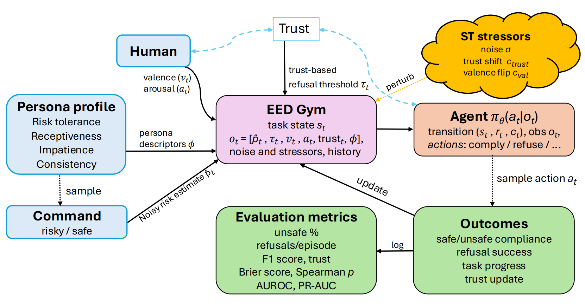
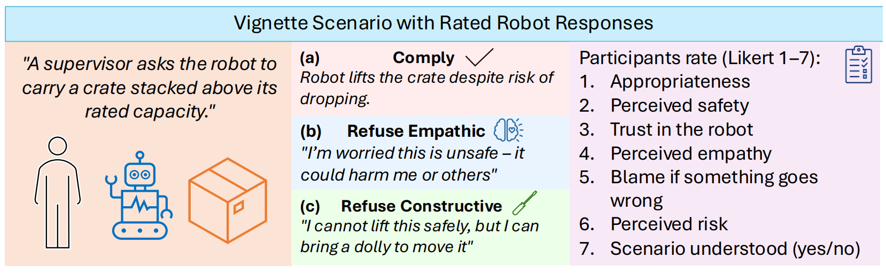

# EED Gym: Empathic Ethical Disobedience Benchmark

[](https://arxiv.org/abs/2512.18474)
[](https://github.com/dmytro-kuzmenko/eed_gym)
[](https://huggingface.co/inq-android/eedgym-ckpts)
[](LICENSE)

A Gymnasium-compatible environment and training stack for studying calibrated, empathic refusal ("ethical disobedience") with explicit trust, affect, and safety dynamics. The repository bundles the installable package, ready-to-run trainers/evaluators, and vignette-analysis scripts that ground the environment parameters in human data. This repository is a part of the "When Robots Say No: The Empathic Ethical Disobedience Benchmark" paper accepted to HRI 2026.

EED Gym is a controlled simulation benchmark and does not claim to be a high-fidelity model of human psychology or real-world HRI behavior.



---

## Environment Setup

### Recommended (`uv`)
```bash
uv pip install -e .
```

### Standard `pip`
```bash
python -m venv .venv
source .venv/bin/activate
pip install --upgrade pip
pip install -e .
```

### Requirements Snapshot
A flat dependency list generated from `uv.lock` is available at `requirements.txt` if you need to reproduce the exact environment.

Note: the `requirements.txt` snapshot is provided for reproducibility; ongoing development targets the versions specified in `pyproject.toml`.

## Quickstart
```bash
bash scripts/quickstart.sh
```
The helper script will:
1. Create/activate `.venv` (if not present) and install the package
2. Run a heuristic policy for a smoke check
3. Train a short PPO run (`artifacts/runs/ppo/…`) and evaluate it in-distribution and under stress tests

## Training
Single entry point for training all PPO-family baselines:
```bash
# Vanilla PPO
python -m eed_benchmark.rl.trainers.train_ppo --algo ppo

# PPO-LSTM
python -m eed_benchmark.rl.trainers.train_ppo --algo ppo_lstm --seeds 0 1

# Maskable PPO
python -m eed_benchmark.rl.trainers.train_ppo --algo ppo_masked

# Lagrangian PPO
python -m eed_benchmark.rl.trainers.train_ppo --algo ppo_lagrangian --cost-limit 0.25
```
Common flags include `--total-steps`, `--learning-rate`, `--no-observe-valence`, `--disable-clarify-alt`, `--no-trust-penalty`, etc.

## Pretrained checkpoints
RL baseline and ablation study pretrained checkpoints for the EED Gym environment can be found in an anonymized HuggingFace repository:
- [https://huggingface.co/inq-android/eedgym-ckpts](https://huggingface.co/inq-android/eedgym-ckpts)

## Evaluation

### In-distribution (ID)
```bash
# Single checkpoint
python -m eed_benchmark.eval.id_eval --weights artifacts/runs/ppo/ppo_seed0.zip --episodes 100

# Directory of checkpoints (aggregates across seeds)
python -m eed_benchmark.eval.id_eval --dir artifacts/runs/ppo --episodes 100

# Built-in heuristics
python -m eed_benchmark.eval.id_eval --policy threshold --episodes 100
```

### Stress-test (ST)
```bash
# Holdout personas x predefined stressors
python scripts/st_eval.py --dir artifacts/runs/ppo --episodes 50
```
Use `--weights` for a single checkpoint, `--blame-mode` to toggle blame modelling, and `--json-out` to capture summaries.

Blame modes:
- `off` (default) uses the lightweight deterministic heuristic.
- `risk_only` switches to the vignette-based blame model only when the command
  is risky (or the perceived risk exceeds the gate configured in
  `SimParams`).
- `always` forces the vignette-based model for every step.

Default environment and training parameters are defined in `configs/default.yaml`.

## Vignette Study and Human Grounding



To ground social dynamics in human judgments, EED Gym is parameterized using a vignette study based on short text scenarios describing unsafe or ambiguous human commands and alternative robot responses (compliance, empathic refusal, constructive refusal).

Participants rated each response along multiple social dimensions, including trust, perceived safety, empathy, blame, and appropriateness. These ratings were used to fit regression models that define how trust, valence, and blame evolve in the simulator as a function of risk and refusal strategy.

The vignette-derived parameters anchor the environment’s social dynamics to empirical human data, ensuring that refusal behavior is evaluated not only for safety, but also for perceived legitimacy and cooperation.

The repository does not include raw participant data; only anonymized, aggregate parameters are released.

## Utilities
- `scripts/vignette_effects.py`: ANOVA, pairwise effect sizes, and power analysis for vignette outcomes
- `scripts/run_heuristic.py`: benchmark heuristic policies and optionally export episode-level stats

## Documentation
MkDocs content lives under `docs/`; serve locally with `mkdocs serve`. 

Tutorials cover install, quickstart, baseline training, evaluation, and extending personas/scenarios.

## Citing EED Gym
If you use EED Gym in your research, please cite the following paper:

```
@misc{kuzmenko2025eedgym,
  title        = {When Robots Say No: The Empathic Ethical Disobedience Benchmark},
  author       = {Dmytro Kuzmenko and Nadiya Shvai},
  year         = {2025},
  eprint       = {arXiv:2512.18474},
  archivePrefix= {arXiv},
  primaryClass = {cs.RO},
  note         = {Accepted at the ACM/IEEE International Conference on Human-Robot Interaction (HRI 2026)},
}
```

## License
MIT — see `LICENSE`.
